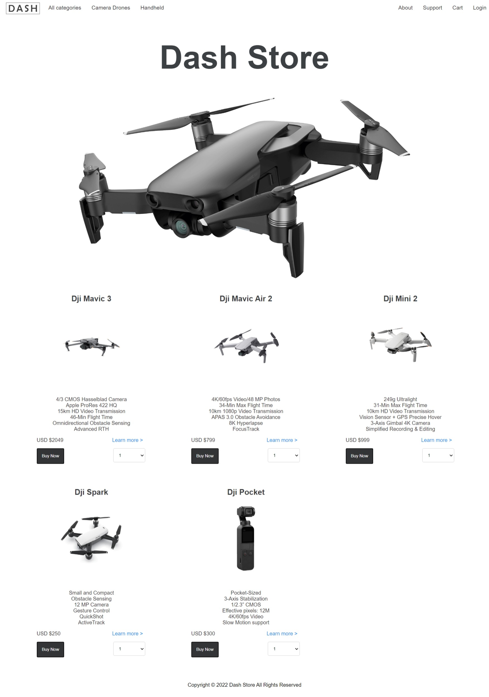
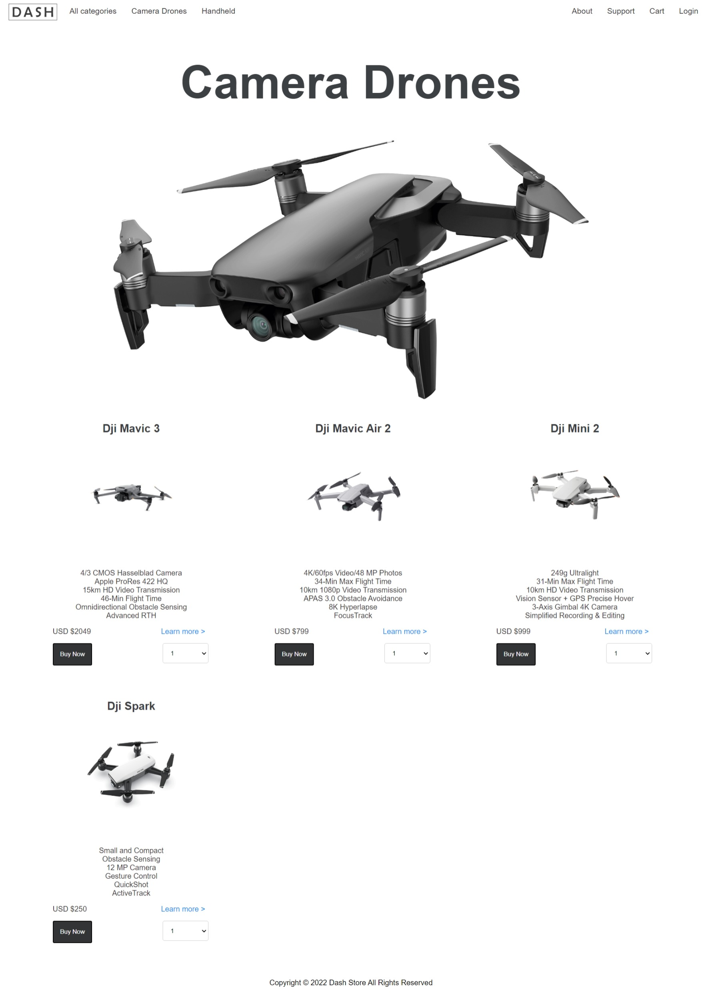
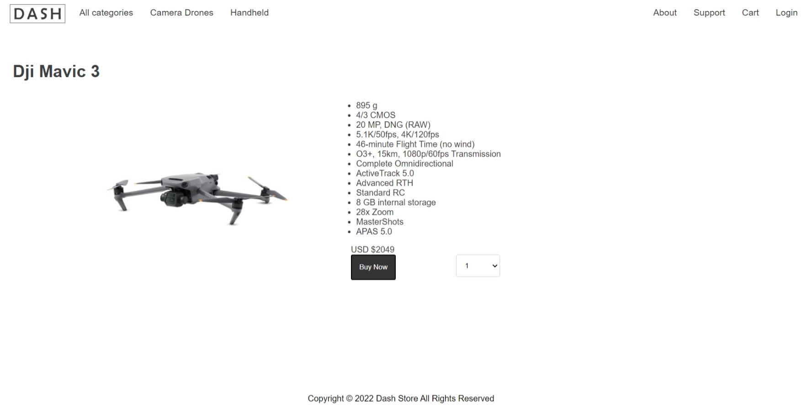
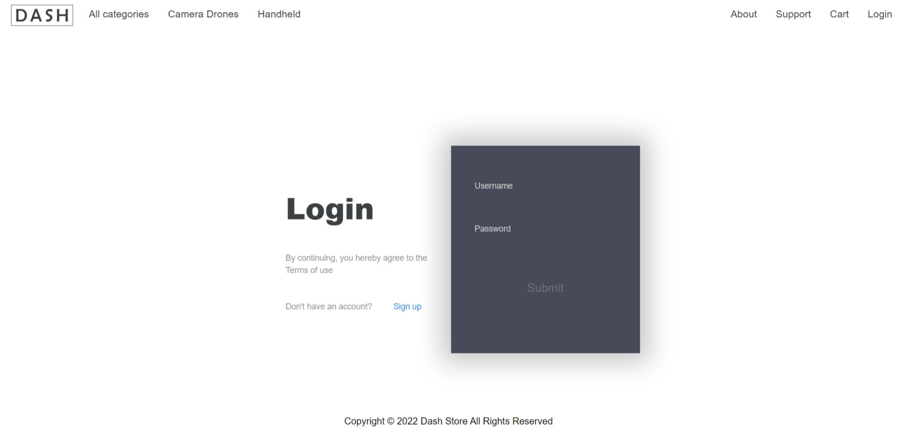
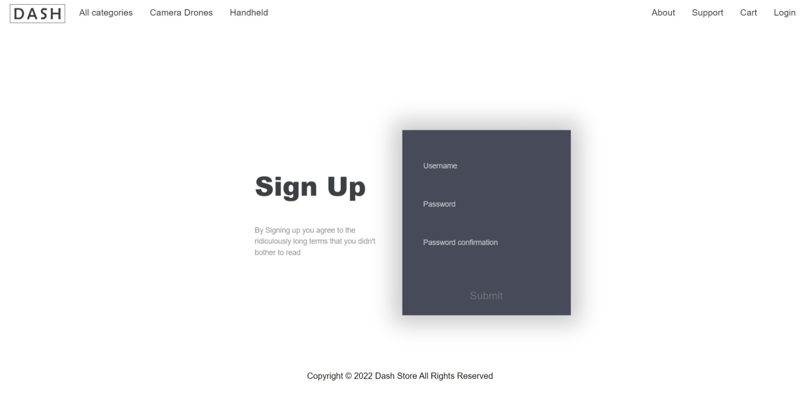
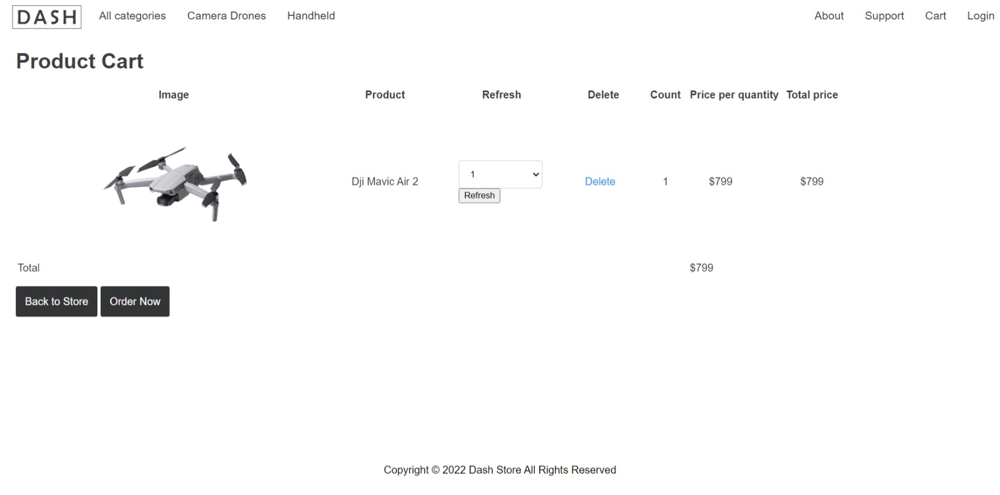
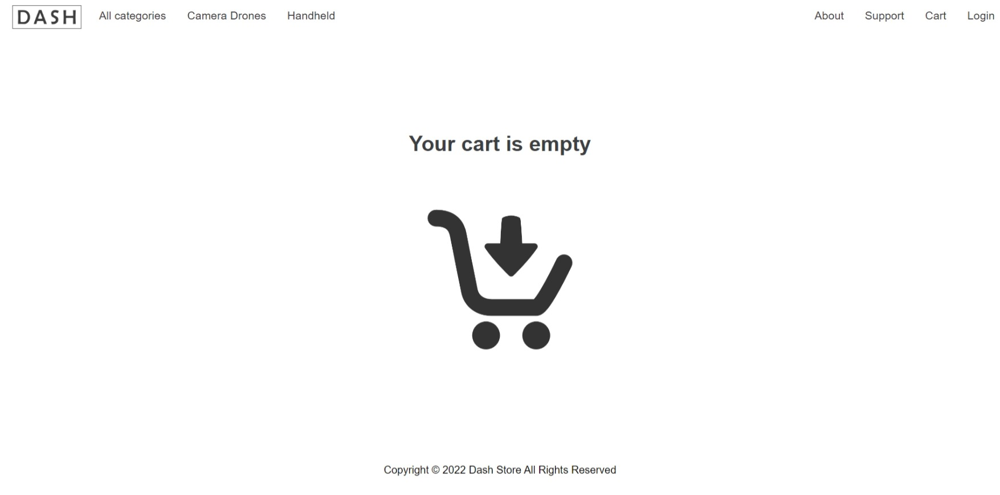
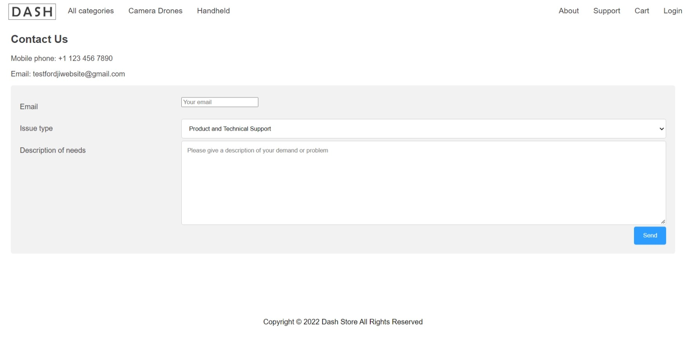
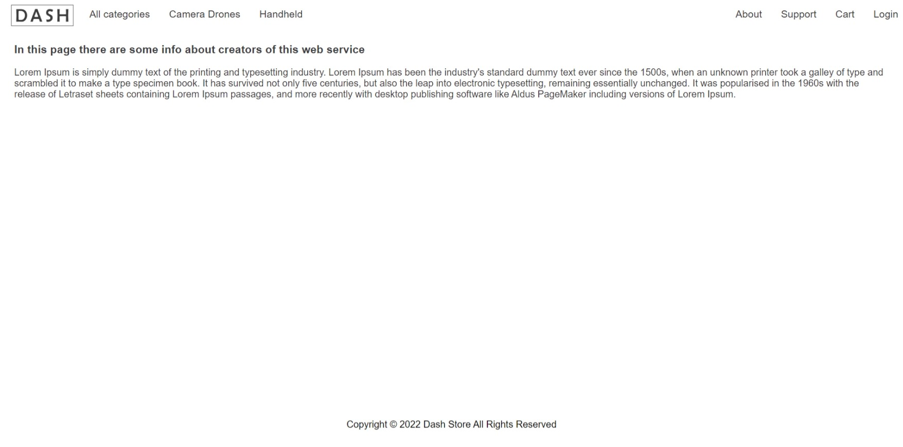

# Требования к проекту

---

# Содержание
1 [Введение](#intro)  
1.1 [Назначение](#appointment)  
1.2 [Бизнес-требования](#business_requirements)  
1.2.1 [Исходные данные](#initial_data)  
1.2.2 [Возможности бизнеса](#business_opportunities)  
1.2.3 [Границы проекта](#project_boundary)  
1.3 [Обзор аналогов](#analogues)  
2 [Требования пользователя](#user_requirements)  
2.1 [Программные интерфейсы](#software_interfaces)  
2.2 [Интерфейс пользователя](#user_interface)  
2.3 [Характеристики пользователей](#user_specifications)  
2.3.1 [Классы пользователей](#user_classes)  
2.3.2 [Аудитория приложения](#application_audience)  
2.3.2.1 [Целевая аудитория](#target_audience)  
2.3.2.1 [Побочная аудитория](#collateral_audience)  
2.4 [Предположения и зависимости](#assumptions_and_dependencies)  
3 [Системные требования](#system_requirements)  
3.1 [Функциональные требования](#functional_requirements)  
3.1.1 [Основные функции](#main_functions)  
3.1.1.1 [Вход пользователя в приложение](#user_logon_to_the_application)  
3.1.1.2 [Загрузка товаров](#download_products)  
3.1.1.3 [Просмотр информации об отдельной позиции](#download_product)  
3.1.1.4 [Добавление в корзину](#add_to_cart)  
3.1.1.5 [Оформление заказа](#order)  
3.1.1.6 [Выход зарегистрированного пользователя из учётной записи](#logout)  
3.1.1.7 [Регистрация нового пользователя после входа в приложение](#add_new_user)  
3.1.1.8 [Обращение в службу поддержки](#support)  
3.1.2 [Ограничения и исключения](#restrictions_and_exclusions)  
3.2 [Нефункциональные требования](#non-functional_requirements)  
3.2.1 [Атрибуты качества](#quality_attributes)  
3.2.1.1 [Требования к удобству использования](#requirements_for_ease_of_use)  
3.2.1.2 [Требования к безопасности](#security_requirements)  
3.2.2 [Внешние интерфейсы](#external_interfaces)  
3.2.3 [Ограничения](#restrictions)

<a name="intro"/>

# 1 Введение

<a name="appointment"/>

## 1.1 Назначение
В этом документе описаны функциональные и нефункциональные требования к веб-сервису
«Dash». Этот документ предназначен для команды, которая будет реализовывать и проверять
корректность работы приложения. 

<a name="business_requirements"/>

## 1.2 Бизнес-требования

<a name="initial_data"/>

### 1.2.1 Исходные данные
Квадрокоптеры все больше и больше захватывают мир. С каждым годом дроны становятся быстрее,
их камера снимает лучше, а стоят они дешевле. Это приводит к тому, что все больше и больше
людей могут позволить себе квадрокоптер для того, чтобы посмотреть на мир под другим углом.  
Для этого необходимо выбрать правильную модель, которая будет соответствовать нуждам
человека, а так же не попасться на подделку. Приложение будет разработано с целью упростить
выбор дрона, дать детальное описание каждого продукта, а так же гарантировать оригинальность
устройства.

<a name="business_opportunities"/>

### 1.2.2 Возможности бизнеса
Многие люди желают иметь приложение, которое позволит им найти нужную модель устройства,
получить полные его характеристики, а так же оформить заказ без лишних трудностей.
Необязательная регистрация позволит увеличить количество людей, использующих приложение.

<a name="project_boundary"/>

### 1.2.3 Границы проекта
Приложение "Dash" позволит всем пользователям просматривать информацию о ценах и
характеристиках товара. Позволит оформить заказ, а так же, в случае необходимости,
связаться со службой поддержки через интуитивно понятную форму.

<a name="analogues"/>

## 1.3 Обзор аналогов
Dji - Компания была основана в 2006 году Фрэнком Ваном. По состоянию на март 2020 года
на долю DJI приходится около 70% мирового рынка потребительских дронов. 
Его технология беспилотных камер широко используется в музыкальной, телевизионной
и киноиндустрии. Продукция компании также использовалась вооруженными силами и полицией.  
3D Robotics - американская компания, которая производит корпоративное программное
обеспечение для дронов для строительных, инженерных и горнодобывающих фирм,
а также государственных учреждений. До 2016 года компания разрабатывала и продавала
коммерческие и прогулочные беспилотные летательные аппараты. Они производили
потребительские дроны, готовые к полету квадрокоптеры для аэрофотосъемки
и картографирования, а также беспилотные летательные аппараты с неподвижным крылом
на базе платформы Ardupilot. По состоянию на сентябрь 2016 года 3DR и основное сообщество
разработчиков открытого исходного кода Ardupilot разошлись из-за разногласий по поводу
лицензии на открытый исходный код, на котором основаны продукты 3DR.

<a name="user_requirements"/>

# 2 Требования пользователя

<a name="software_interfaces"/>

## 2.1 Программные интерфейсы
 Веб-сервис использует следующий стек технологий:

* Бэкенд:
    - Язык Python
    - фреймворк Django
    - БД SQLite3
    - Django ORM
* Фронтенд:
    - HTML5, CSS3
    - Java Script

<a name="user_interface"/>

## 2.2 Интерфейс пользователя
 Далее представлен интерфейс, разработанный совместно с дизайнером.
 При входе в приложение, пользователь попадает на главный экран.

Главный экран.

При нажатии на тип товара в верхней части экрана, список товаров должен быть
отфильтрован в соответствии с выбранным типом и обновлён.  

Отфильтрованный главный экран

  

При нажатии на кнопку товара "Learn more", пользователь попадает на экран с подробной
информацией о нем. Здесь клиент может прочитать полную информацию о товаре, выбрать
необходимое ему количество и добавить в корзину, нажав на кнопку "Bye".

Экран подробнее

  

В правом верхнем углу присутствуют кнопки "Login", "Cart", "Support", "About". По нажатии
на кнопку "Login" открывается форма входа в аккаунт.

Форма входа в аккаунт

Если у пользователя нет аккаунта, он может зарегистрироваться, нажав на ссылку 
"Sign up".

Форма регистрации

По нажатии на кнопку "Cart" открывается экран корзины, на котором пользователь
может просмотреть свой заказ, отредактировать в случае необходимости и оформить его.

Экран корзины

Если корзина пуста, то выводится заглушка.

Пустой экран корзины

По нажатии на кнопку "Support" открывается экран с контактными данными и формой,
в которой пользователь может задать, интересующий его вопрос.

Экран поддержки

По нажатии на кнопку "About" открывается экран с информацией о сайте и компании.

Экран о сайте

<a name="user_specifications"/>

## 2.3 Характеристики пользователей

<a name="user_classes"/>

### 2.3.1 Классы пользователей

| Класс пользователей             | Описание                                                                |
|:--------------------------------|:------------------------------------------------------------------------|
| Анонимные пользователи          | Пользователи, которые не хотят регистрироваться в приложении.           |
| Зарегистрированные пользователи | Пользователи, которые вошли в приложение под своим именем (псевдонимом) |

<a name="application_audience"/>

### 2.3.2 Аудитория приложения

<a name="target_audience"/>

#### 2.3.2.1 Целевая аудитория
Люди средней возрастной категорией со средним или высшем уровнем образования,
обладающие минимальной технической грамотностью

<a name="collateral_audience"/>

#### 2.3.2.2 Побочная аудитория
Люди младшей и старшей возрастной категории, обладающие вышеперечисленными качествами.

<a name="assumptions_and_dependencies"/>

## 2.4 Предположения и зависимости
1. Приложение не работает при отсутствии подключения к Интернету;
2. Приложение не обрабатывает данные RSS-лент, недоступных в момент запроса.

<a name="system_requirements"/>

# 3 Системные требования

<a name="functional_requirements"/>

## 3.1 Функциональные требования

<a name="main_functions"/>

### 3.1.1 Основные функции

<a name="user_logon_to_the_application"/>

#### 3.1.1.1 Вход пользователя в приложение
**Описание.** Пользователь имеет возможность использовать приложение без создания
собственного профиля либо войдя в свою учётную запись.

| Функция                                                              | Требования                                                                                                                                                      | 
|:---------------------------------------------------------------------|:----------------------------------------------------------------------------------------------------------------------------------------------------------------|
| Вход в приложение без создания собственного профиля                  | Приложение должно предоставить пользователю возможность войти в приложение анонимно                                                                             |
| <a name="registration_requirements"/>Регистрация нового пользователя | Приложение должно запросить у пользователя ввести имя для создания учётной записи. Пользователь должен либо ввести имя, либо отменить действие                  |
| *Пользователь с таким именем существует*                             | *Приложение должно известить пользователя об ошибке регистрации и запросить ввод псевдонима. Пользователь должен либо ввести псевдоним, либо отменить действие* |
| Вход зарегистрированного пользователя в приложение                   | Пользователь должен ввести  свое имя или псевдоним, а так же пароль для входа в аккаунт                                                                         |

<a name="download_products"/>

#### 3.1.1.2 Загрузка товаров
**Описание.** После входа пользователя в приложение необходимо загрузить список
доступных к покупке товаров.
 
| Функция                 | Требования                                                                                                                                              | 
|:------------------------|:--------------------------------------------------------------------------------------------------------------------------------------------------------|
| Загрузка списка товаров | Приложение должно загрузить список товаров доступных к покупке. В случае ошибки или отсутствия интернета должно быть выведено соответствующее сообщение |
| Фильтрация товаров      | Приложение должно иметь возможность фильтрации по типу: "Camera Drones", "Handheld"                                                                     |

<a name="download_product"/>

#### 3.1.1.3 Просмотр информации об отдельной позиции
**Описание.** Пользователь имеет возможность просмотреть информацию о каждом товаре,
представленной в таблице.

| Функция                       | Требования                                                                                                                                                     | 
|:------------------------------|:---------------------------------------------------------------------------------------------------------------------------------------------------------------|
| Просмотр подробной информации | Пользователь имеет возможность просмотреть подробную информацию о товаре, нажав на кнопку "Learn more". Приложение должно отобразить полные его характеристики |

<a name="add_to_cart"/>

#### 3.1.1.4 Добавление в корзину
**Описание.** Пользователь имеет возможность добавить товар в корзину.

| Функция              | Требования                                                                                                                                                                                     | 
|:---------------------|:-----------------------------------------------------------------------------------------------------------------------------------------------------------------------------------------------|
| Добавление в корзину | Пользователь имеет возможность добавить товар в корзину, предварительно выбрав количество (по умолчанию равно 1), кликом по кнопке "Bye Now" на главном экране или экране просмотра информации |
| Удаление из корзины  | Пользователь имеет возможность удалить товар из корзины, нажатием на кнопку "Delete". Из корзины должен исчезнуть удаленный товар                                                              |

<a name="order"/>

#### 3.1.1.5 Оформление заказа
**Описание.** Пользователь имеет возможность оформить заказ.

| Функция           | Требования                                                                                                                                                                                                                                                                                                                                                        |
|:------------------|:------------------------------------------------------------------------------------------------------------------------------------------------------------------------------------------------------------------------------------------------------------------------------------------------------------------------------------------------------------------|
| Оформление заказа | Пользователь имеет возможность перейти на фрагмент "Корзина", путем нажатия на кнопку "Cart". На этом фрагменте должен выводится список товаров, добавленных в корзину и их количество. По нажатии на кнопку "Order Now" пользователь должен попасть в меню оформления заказа. Там он должен ввести свое имя, номер телефона и адрес, куда будет доставлен заказ. |

<a name="logout"/>

#### 3.1.1.6 Выход зарегистрированного пользователя из учётной записи
**Описание.** Зарегистрированный пользователь имеет возможность выйти из учётной записи.

**Требование.** Приложение должно предоставить зарегистрированному пользователю
возможность выйти из учётной записи с возвратом к окну входа в приложение.

<a name="add_new_user"/>

#### 3.1.1.7 Регистрация нового пользователя после входа в приложение
**Описание.** Анонимный пользователь имеет возможность зарегистрироваться в приложении.

**Требование.** Приложение должно предоставить анонимному пользователю возможность.
[Зарегистрироваться в приложении](#registration_requirements). 

<a name="support"/>

#### 3.1.1.8 Обращение в службу поддержки

**Описание.** Пользователь имеет возможность обратится в службу поддержки, если у
него возникли какие-либо вопросы.

| Функция                      | Требования                                                                                                                                                                                                                                                                                                                                                                                                                                                                                         |
|:-----------------------------|:---------------------------------------------------------------------------------------------------------------------------------------------------------------------------------------------------------------------------------------------------------------------------------------------------------------------------------------------------------------------------------------------------------------------------------------------------------------------------------------------------|
| Обращение в службу поддержки | Пользователь имеет возможность перейти в раздел поддержки, нажав на кнопку "Support". На этом фрагменте должны отображаться контактные данные для связи с службой поддержки напрямую, а так же форма, заполнив которую, он сможет отправить вопрос в службу поддержки. Форма включает следующие поля: "Email" - адрес электронной почты, на которую пользователь хочет получить ответ, "Issue type" - форма с выбором типа проблемы, "Description of needs" - полное описание вопроса пользователя |

<a name="restrictions_and_exclusions"/>

### 3.1.2 Ограничения и исключения
1. Приложение работает только при наличии подключения к Интернету; 
2. Заказ происходит только при правильно заполненных полях имени, телефона и адреса.

<a name="non-functional_requirements"/>

## 3.2 Нефункциональные требования

<a name="quality_attributes"/>

### 3.2.1 Атрибуты качества

<a name="requirements_for_ease_of_use"/>

#### 3.2.1.1 Требования к удобству использования
1. Доступ к основным функциям приложения не более чем за одну операцию;
2. Все функциональные элементы пользовательского интерфейса имеют названия,
описывающие действие, которое произойдет при выборе элемента;
3. Обновление информации о товарах происходит при каждом новом запуске приложения.

<a name="security_requirements"/>

#### 3.2.1.2 Требования к безопасности
Приложение предоставляет возможность заказа пользователю с валидным номером.

<a name="external_interfaces"/>

### 3.2.2 Внешние интерфейсы
Окна приложения удобны для использования пользователями с плохим зрением:
  * размер шрифта не менее 14пт;
  * функциональные элементы контрастны фону окна.

<a name="restrictions"/>

### 3.2.3 Ограничения
1. Поддержка сертификата IdenTrust DST Root CA X3.
